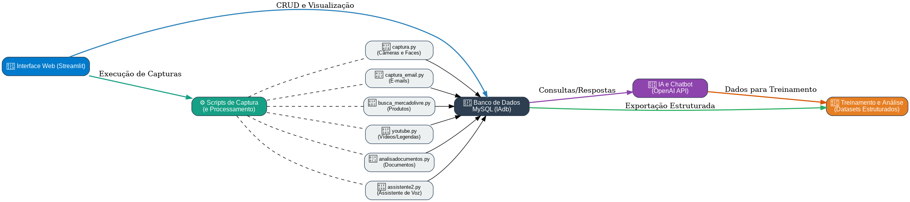

# TreinamentosIA: Ferramentas Integradas para Captura e Processamento de Dados

Este projeto disponibiliza um **framework completo** para **coleta**, **processamento** e **organização** de dados multimodais (voz, imagem, texto e produtos) com o objetivo de gerar bases de treinamento para modelos de IA.

---

## 📖 Visão Geral do Projeto

O fluxo principal do sistema consiste em:

1. **Captura de dados**: coleta automática de áudio, vídeo, imagens de câmeras, e-mails e informações de e‑commerce.
2. **Pós‑processamento**: transcrição de áudio, extração de texto de documentos, detecção de rostos e geração de metadados.
3. **Armazenamento estruturado**: persistência de todos os registros em um banco MySQL.
4. **Interface web**: painel de controle via Streamlit para gerenciar fontes, visualizar resultados e exportar dados.

O diagrama a seguir ilustra a arquitetura de componentes:



---

## ⚙️ Funcionalidades Principais

- **Assistente de voz** (`assistente2.py`): ativa por palavra‑chave (“computador”), registra perguntas e reproduz respostas em áudio.
- **Captura de imagem** (`captura.py`): grava frames de webcam ou Kinect e salva no banco.
- **Detecção de faces** (`captura_face.py`): recorta rostos nas imagens e armazena atributos como emoção e idade.
- **Processamento de imagens** (`processaimg.py`): executa scripts customizados cadastrados no banco para enriquecer metadados.
- **Coleta de vídeos YouTube** (`youtube.py`): busca vídeos por termo, transcreve áudio/legendas e insere frases no banco.
- **Coleta de e‑mails** (`captura_email.py`): lê contas POP3, baixa mensagens e grava no banco.
- **Busca em e‑commerce** (`busca_mercadolivre.py`): pesquisa produtos no Mercado Livre e registra resultados.
- **Processamento de documentos** (`analisadocumentos.py`, `processa_pdf.py`, `processa_txt.py`): extrai texto de PDFs/TXT para a tabela de documentos.
- **Geração de respostas IA** (`processachatbot.py`): utiliza a API OpenAI para responder perguntas pendentes.
- **Interface Web** (`web/app.py`): painel Streamlit para monitorar e controlar todas as etapas.

---

## 🗄️ Banco de Dados e Tabelas

Todas as informações são armazenadas no banco MySQL `IAdb`. As principais tabelas e seus propósitos:

| Tabela                   | Descrição                                                             |
|--------------------------|-----------------------------------------------------------------------|
| `perguntas`             | Frases capturadas (voz, vídeos, documentos)                           |
| `respostas`             | Respostas geradas (IA ou scripts customizados)                        |
| `subpergunta`           | Fragmentos de perguntas longas divididos automaticamente              |
| `documentos`            | Texto extraído de arquivos (PDF, DOCX, TXT)                           |
| `foto`                  | Imagens brutas capturadas pela câmera                                 |
| `face`                  | Recortes de faces detectadas                                          |
| `face_informacao`       | Metadados extraídos das faces (emoção, idade, gênero, etc.)           |
| `contas_email`          | Configurações de contas POP3                                          |
| `emails`                | Mensagens de e‑mail baixadas                                          |
| `termobusca`            | Termos para busca de vídeos no YouTube                                |
| `item_compra`           | Itens de interesse para busca no Mercado Livre                        |
| `item_compra_resultado` | Resultados retornados pela busca de produtos                          |

### Script de criação do banco

```sql
-- Cria banco e tabelas principais
CREATE DATABASE IF NOT EXISTS IAdb;
USE IAdb;

-- Exemplo simplificado de tabela perguntas
CREATE TABLE perguntas (
  id INT AUTO_INCREMENT PRIMARY KEY,
  texto TEXT NOT NULL,
  origem VARCHAR(50),
  data_criacao DATETIME DEFAULT CURRENT_TIMESTAMP
);
-- Demais tabelas seguem estrutura similar, veja `mysql/IAdb.sql`
```

---

## 🚀 Instalação e Execução

### Pré-requisitos

- Docker Engine & Docker Compose (v2+)
- Git
- (Opcional) Python 3.10+ para execução local sem Docker

### Configuração do ambiente

1. Clone o repositório:
   ```bash
   git clone https://github.com/seu-usuario/TreinamentosIA.git
   cd TreinamentosIA
   ```
2. Copie o arquivo de exemplo `.env.example` para `docker/.env` e edite com suas credenciais:
   ```bash
   cp .env.example docker/.env
   vim docker/.env
   ```

### Execução via Docker

No diretório `docker/`, execute:

```bash
# Compila a imagem (inclui dependências e headers para PyAudio)
make build

# Sobe os containers (app + banco MySQL)
make up

# Visualiza logs em tempo real
make logs

# Para e remove containers
make down
```

Após o container subir, a interface Streamlit estará disponível em `http://localhost:8501`.

### Execução local (sem Docker)

1. Instale dependências:
   ```bash
   pip install -r requirements.txt
   ```
2. Configure e crie o banco MySQL localmente, rodando `mysql/IAdb.sql`.
3. Execute módulos diretamente, ex:
   ```bash
   python assistente2.py
   python captura.py
   ```

---

## 📂 Estrutura de Diretórios

```
. 
├── docker/                # Dockerfile, compose e scripts de orquestração
├── mysql/                 # Script SQL de criação do banco
├── web/                   # Código da interface Streamlit
├── app/                   # Módulos de captura e processamento
├── .env.example           # Exemplo de variáveis de ambiente
└── README.md              # Documentação do projeto
```

---

## 📝 Licença

Uso livre para fins educacionais e pesquisa. Sinta-se à vontade para adaptar e contribuir!
